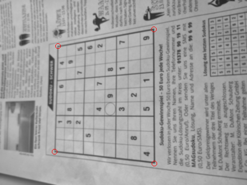

# sudoku-solver
A web application for solving sudokus.

See the result here:
http://sudoku-solver.eu-central-1.elasticbeanstalk.com/ 
## Solving Sudokus

## Sudoku Computer Vision

The easiest way to solve a sudoku from a picture is when it is in the form of the following picture:

In that case we can devide the width and height of the picture by 9 and then we can cut out each digit. 
Thus we first need to be able to create from a normal picture

a picture where we only see the sudoku and without an angle. For this we need to find 4 points from which we know where they lay in the picture with the changed perspective. These 4 point are the vertices of the sudoku. We know that they are connected by straight lines when we view them from the front.

Therefore the first goal is to find the sudoku inside of a picture. We do this by tracing all contours in the picture and then choose the biggest, i.e. with the most pixels. This works very well due to the fact that when we take a picture from a sudoku it is usually the biggest object in the picture. Still this is a limitation since if there is an contour around the sudoku it won't work.
But for our picture from above it works.

Now the next step is to identify the vertices in the contour of the sudoku. For this I go clockwise around the contour and write in a list the change in direction from one pixel to the next in the contour. I assign each direction a number: 0 - right, 1 - right/down, 2 - down, 3 - down/left, 4 - left, 5 - left/up, 6 - up, 7 - up/right.
We can put these in a graph by counting through the pixels of the contour and get:

We can clearly by the points where the graph makes a step of two, that in these pixels are our vertices.

Now when drawing circles around these pixels in the original image we indeed get the desired output.

Putting this together we get the transformed image from start.

